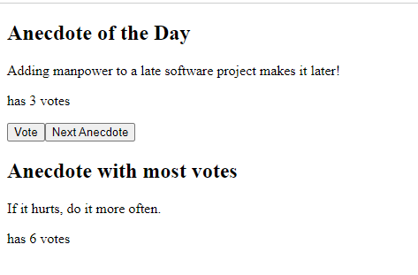
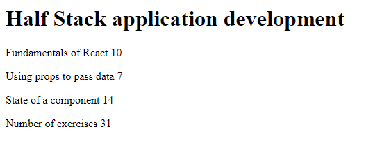
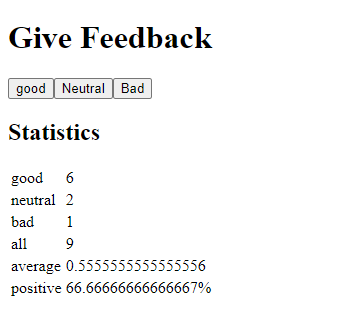

### PART 1: ASSIGNMENTS  
##### STATUS: COMPLETED ✅

To run the application: use ```npm install && npm run```

#### 1. Anecdotes:- ✅

- Anecdotes app made in React shows random anecdotes and we can vote a individual anecdote
- Anecdote with highest votes is also maintained




#### 2. Course-info:- ✅

- Course-info is an app made in react which gives tests basic knowledge of react functional components
- it shows course content and Total number of exercises




#### 3. Unicafe:- ✅

- unicafe is a feedback app which tracks the feedback given by the user good, bad and neutral.
- also shows the average and positive voting percentage.

